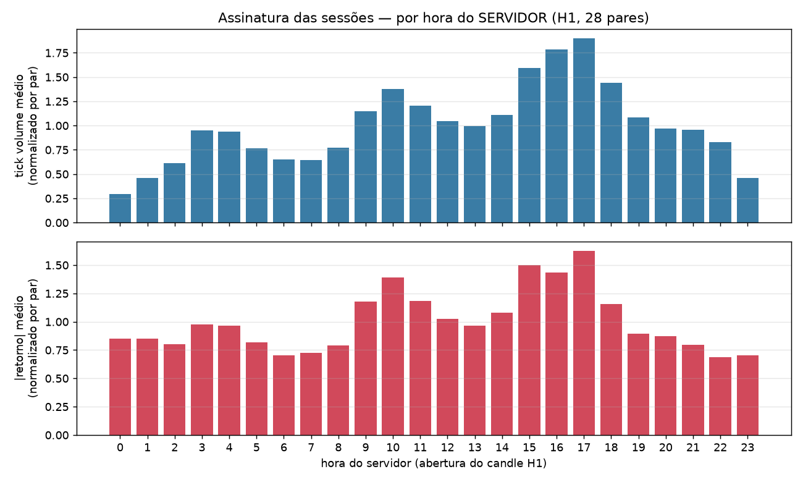

# E01 — Inventário de cobertura dos dados exportados

## O que perguntamos

Os CSVs exportados do MT5 estão completos e íntegros o suficiente para alimentar o pipeline
(28 pares × 8 TFs, períodos do config.yaml, sem buracos escondidos)? E: em que horas do
relógio do SERVIDOR as sessões realmente acordam (calibração do adendo 2026-07-15)?

## Como testamos

Para cada arquivo par×TF: contagem de linhas, primeira/última barra vs. período esperado,
duplicatas, barras fora de ordem, preços inválidos e buracos — intervalos entre barras
consecutivas maiores que o TF, ignorando os que contêm sábado (💡 fim de semana é fechamento
normal do mercado, não defeito). Buracos ≤ 3 barras viram NaN
(regra do painel); maiores marcam janelas a excluir (Plano B do PLANO §7) e são classificados:
**fechamento global** quando 26+ dos 28 pares apagam na mesma janela (feriado ou feed fora do ar)
vs. **específico de par** (buraco só daquele símbolo). Ambos saem da análise; a lista completa vai
para `E01_janelas_excluidas.csv`, que o pipeline (E2/E4) consome. A assinatura das
sessões vem do H1 de todos os pares: tick volume e |retorno| médios por hora do servidor,
normalizados por par (💡 senão os pares mais líquidos dominariam a média).

## Resultados

**Export:** server_time=2026.07.16 00:47:26 | gmt_time=2026.07.15 21:47:26 | offset_server_gmt_h=3.0 · **56 arquivo(s) em esquema legado** (coluna `time`, export anterior; TFs: H1, M30) — mesmos dados OHLCV, hora do servidor igual

| TF | arquivos | linhas (mín–máx) | cobre início | cobre fim | buracos ≤3 (viram NaN) | buracos >3 globais (fechamento) | buracos >3 específicos | linhas inválidas |
|---|---|---|---|---|---|---|---|---|
| M5 | 28 | 147545–148587 | 28/28 | 28/28 | 418 | 392 em 14 janela(s) | 62 | 0 |
| M15 | 28 | 49199–49543 | 28/28 | 28/28 | 173 | 308 em 11 janela(s) | 5 | 0 |
| M30 | 28 | 55613–56232 | 0/28 | 28/28 | 116 | 280 em 10 janela(s) | 8 | 0 |
| H1 | 28 | 27818–28122 | 0/28 | 28/28 | 63 | 251 em 9 janela(s) | 6 | 0 |
| H4 | 28 | 8486–8554 | 28/28 | 28/28 | 65 | 112 em 4 janela(s) | 23 | 0 |
| D1 | 28 | 1421–1429 | 28/28 | 28/28 | 89 | 0 em 0 janela(s) | 0 | 0 |
| W1 | 28 | 545–548 | 28/28 | 28/28 | 0 | 0 em 0 janela(s) | 0 | 0 |
| MN1 | 28 | 126–126 | 28/28 | 28/28 | 0 | 0 em 0 janela(s) | 0 | 0 |

**Leitura:** cada linha resume um timeframe: quantos pares chegaram, se o histórico cobre o período pedido no config.yaml e quantos buracos existem fora de fim de semana. Buracos >3 barras NÃO bloqueiam o E2: viram janelas de exclusão (regra congelada no PLANO §7), gravadas em E01_janelas_excluidas.csv. Bloqueia = arquivo ausente, período não coberto ou linha inválida; aqui há 2 pendência(s) desse tipo, detalhadas abaixo.

### Janelas de fechamento global (mercado/feed parado para todos)

| TF | sem barras desde | até | pares afetados |
|---|---|---|---|
| M5 | 2024-07-02 12:05:00 | 2024-07-03 00:00:00 | 28/28 |
| M5 | 2024-12-24 23:40:00 | 2024-12-26 00:10:00 | 28/28 |
| M5 | 2024-12-31 23:55:00 | 2025-01-02 00:00:00 | 28/28 |
| M5 | 2025-01-07 04:00:00 | 2025-01-07 07:00:00 | 28/28 |
| M5 | 2025-01-07 10:55:00 | 2025-01-07 11:55:00 | 28/28 |
| M5 | 2025-05-26 16:05:00 | 2025-05-26 17:40:00 | 28/28 |
| M5 | 2025-07-03 03:00:00 | 2025-07-03 12:10:00 | 28/28 |
| M5 | 2025-07-04 04:00:00 | 2025-07-04 10:25:00 | 28/28 |
| M5 | 2025-07-04 14:25:00 | 2025-07-04 14:50:00 | 28/28 |
| M5 | 2025-09-22 16:20:00 | 2025-09-22 16:55:00 | 28/28 |
| M5 | 2025-10-23 20:05:00 | 2025-10-23 22:05:00 | 28/28 |
| M5 | 2025-12-24 23:55:00 | 2025-12-26 00:00:00 | 28/28 |
| M5 | 2025-12-31 23:55:00 | 2026-01-02 00:00:00 | 28/28 |
| M5 | 2026-02-26 21:45:00 | 2026-02-27 03:15:00 | 28/28 |
| M15 | 2024-07-02 12:00:00 | 2024-07-03 00:00:00 | 28/28 |
| M15 | 2024-12-24 23:30:00 | 2024-12-26 00:00:00 | 28/28 |
| M15 | 2024-12-31 23:45:00 | 2025-01-02 00:00:00 | 28/28 |
| M15 | 2025-01-07 04:00:00 | 2025-01-07 07:00:00 | 28/28 |
| M15 | 2025-05-26 16:00:00 | 2025-05-26 17:30:00 | 28/28 |
| M15 | 2025-07-03 03:00:00 | 2025-07-03 12:00:00 | 28/28 |
| M15 | 2025-07-04 04:00:00 | 2025-07-04 10:15:00 | 28/28 |
| M15 | 2025-10-23 20:00:00 | 2025-10-23 22:00:00 | 28/28 |
| M15 | 2025-12-24 23:45:00 | 2025-12-26 00:00:00 | 28/28 |
| M15 | 2025-12-31 23:45:00 | 2026-01-02 00:00:00 | 28/28 |
| M15 | 2026-02-26 21:45:00 | 2026-02-27 03:15:00 | 28/28 |
| M30 | 2023-12-25 00:00:00 | 2023-12-28 00:00:00 | 27/28 |
| M30 | 2024-07-02 12:00:00 | 2024-07-03 00:00:00 | 28/28 |
| M30 | 2024-12-24 23:30:00 | 2024-12-26 00:00:00 | 28/28 |
| M30 | 2024-12-31 23:30:00 | 2025-01-02 00:00:00 | 28/28 |
| M30 | 2025-01-07 04:00:00 | 2025-01-07 07:00:00 | 28/28 |
| M30 | 2025-07-03 03:00:00 | 2025-07-03 12:00:00 | 28/28 |
| M30 | 2025-07-04 04:00:00 | 2025-07-04 10:00:00 | 28/28 |
| M30 | 2025-12-24 23:30:00 | 2025-12-26 00:00:00 | 28/28 |
| M30 | 2025-12-31 23:30:00 | 2026-01-02 00:00:00 | 28/28 |
| M30 | 2026-02-26 21:30:00 | 2026-02-27 03:00:00 | 28/28 |
| H1 | 2023-12-25 00:00:00 | 2023-12-28 00:00:00 | 27/28 |
| H1 | 2024-07-02 12:00:00 | 2024-07-03 00:00:00 | 28/28 |
| H1 | 2024-12-24 23:00:00 | 2024-12-26 00:00:00 | 28/28 |
| H1 | 2024-12-31 23:00:00 | 2025-01-02 00:00:00 | 28/28 |
| H1 | 2025-07-03 03:00:00 | 2025-07-03 12:00:00 | 28/28 |
| H1 | 2025-07-04 04:00:00 | 2025-07-04 10:00:00 | 28/28 |
| H1 | 2025-12-24 23:00:00 | 2025-12-26 00:00:00 | 28/28 |
| H1 | 2025-12-31 23:00:00 | 2026-01-02 00:00:00 | 28/28 |
| H1 | 2026-02-26 21:00:00 | 2026-02-27 03:00:00 | 28/28 |
| H4 | 2024-12-24 20:00:00 | 2024-12-26 00:00:00 | 28/28 |
| H4 | 2024-12-31 20:00:00 | 2025-01-02 00:00:00 | 28/28 |
| H4 | 2025-12-24 20:00:00 | 2025-12-26 00:00:00 | 28/28 |
| H4 | 2025-12-31 20:00:00 | 2026-01-02 00:00:00 | 28/28 |

**Leitura:** janelas em que 26+ dos 28 pares ficam sem barras ao MESMO tempo — mercado fechado (Natal, Ano-Novo) ou feed do servidor fora do ar. 💡 Não é defeito dos arquivos: se todo mundo apagou junto, foi o mercado que fechou. Essas janelas saem da análise (exclusão), e é bom que o pipeline não tente interpretá-las como 'ausência de tendência'.

### Buracos específicos de par

| TF | par | sem barras desde | até | barras faltando |
|---|---|---|---|---|
| M5 | GBPNZD | 2025-09-29 00:05:00 | 2025-10-01 00:00:00 | 574 |
| M5 | GBPNZD | 2025-04-03 00:05:00 | 2025-04-03 19:05:00 | 227 |
| M5 | GBPNZD | 2024-08-14 05:00:00 | 2024-08-14 23:40:00 | 223 |
| M15 | GBPNZD | 2025-09-29 00:00:00 | 2025-10-01 00:00:00 | 191 |
| M30 | GBPNZD | 2025-09-29 00:00:00 | 2025-10-01 00:00:00 | 95 |
| M30 | GBPNZD | 2022-07-25 00:00:00 | 2022-07-26 23:30:00 | 94 |
| M15 | GBPNZD | 2025-04-03 00:00:00 | 2025-04-03 19:00:00 | 75 |
| M15 | GBPNZD | 2024-08-14 05:00:00 | 2024-08-14 23:30:00 | 73 |
| H1 | GBPNZD | 2025-09-29 00:00:00 | 2025-10-01 00:00:00 | 47 |
| H1 | GBPNZD | 2022-07-25 00:00:00 | 2022-07-26 23:00:00 | 46 |

**Leitura:** os 10 maiores buracos que afetam POUCOS pares (lista completa: 104 janelas no E01_janelas_excluidas.csv). Quase todos caem em feriados (24–25/12, 31/12–01/01, feriados UK/EUA) em que os pares param em minutos diferentes — mesma natureza dos globais. O caso a vigiar é o par GBPNZD, que tem os maiores buracos individuais; as janelas dele ficam excluídas como as demais.

### Assinatura das sessões

**Leitura:** as horas do servidor em que a atividade mais SALTA em relação à hora anterior são 15h, 9h, 3h — os candidatos naturais a abertura de sessão. Confrontar com o offset server↔GMT do _manifest.csv e com a teoria do config.yaml (Tóquio 3h, Londres ~10h, NY ~15h no horário de verão): onde o dado e a teoria concordarem, a sessão congela nesse horário.

### Pendências

- M30: 28 par(es) não cobrem o início do período esperado — config pede 2021-01-01, primeira barra disponível é 2022-01-03 00:00:00 (ação 👤: reexportar este TF no MT5 desde 2021-01-01; se os arquivos antigos estiverem na pasta do export, apagá-los antes, senão o ExportBarsG8 os pula)
- H1: 28 par(es) não cobrem o início do período esperado — config pede 2021-01-01, primeira barra disponível é 2022-01-03 00:00:00 (ação 👤: reexportar este TF no MT5 desde 2021-01-01; se os arquivos antigos estiverem na pasta do export, apagá-los antes, senão o ExportBarsG8 os pula)

## Confronto com os critérios

O E1 não tem critério C próprio; os limiares usados antecipam o **C3** (banco aprovado):
buracos ≤ 3 barras viram NaN e a taxa de NaN por TF×ano será
cobrada no E4 (≤ 15%). Situação:
✘ pendências listadas acima — resolver (reexportar/registrar exclusões) antes do E2.

## O que isso muda

O E2 só começa depois de reexportar os itens pendentes ou registrar as exclusões como limitação.
A figura de sessões alimenta o congelamento das janelas de sessão em hora do servidor
(config.yaml → sessions.calibracao_server).

## Limitações

- O inventário confere **estrutura**, não conteúdo: preços errados porém plausíveis só aparecem
  na paridade (E3, critério C1).
- Spread histórico não existe em barras do MT5 (limitação documentada no ESBOÇO Q10).
- A assinatura de sessões usa a média de todo o período — mudanças de DST borram ±1h as bordas;
  a janela exata por dia usa o fuso IANA do config.yaml, não esta figura.
